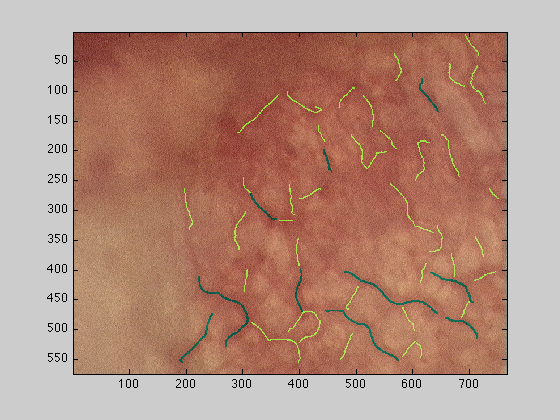
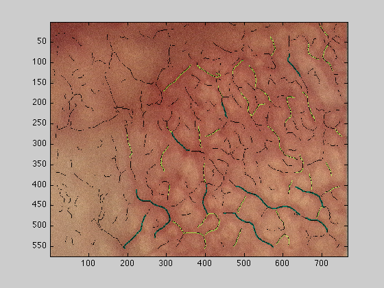
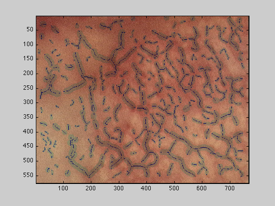
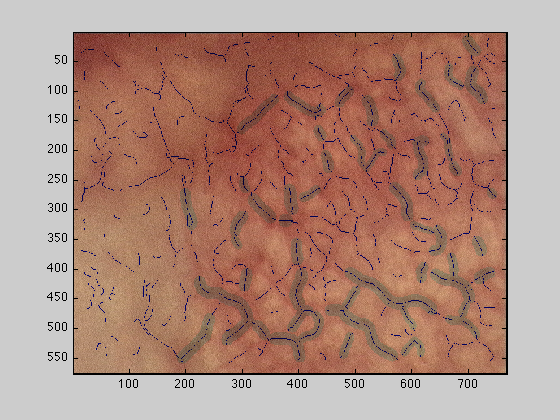
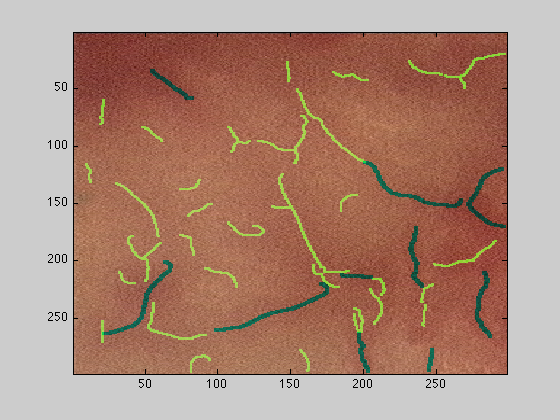

# Scale-Space-Vessel-Tracing
Tracing of the centrelines of microvasculature using a scale-space algorithm

<h1>Tracing the geometric skeleton of the vasculature of a tumour</h1>

<introduction> </introduction>

The analysis of the vasculature of a tumour can be based on the some
of the geometric parameters of the vessels, such as diameter of the
vessels, number of branching points, length between branching points,
or density of vessels in a given area. The following example
illustrates how to perform the geometric analysis using MATLAB and some
specifically designed funcions. The analysis is based on a technique
called "Scale Space" which progressively blurs an image to observe its
characteristics at different "scales": fine details will be observed at
the first scales and then will be erased as the image is filtered,
whilst larger characteristics will dominate the lower scales. For more
detail, the paper by Lindeberg explains the technique: (<a
 href="http://www.nada.kth.se/%7Etony/earlyvision.html">http://www.nada.kth.se/~tony/earlyvision.html</a>)

  

<h2>Reading the images</h2>

First, the images to be analysed have to be read into MATLAB. If the
file is in the working directory one way of reading the data is with
'imread' and 'imagesc' can be used to display it as a figure: 

<pre class="codeinput">dataIn= imread('wt_010906_mouse7_60minsROI2.bmp'); figure(1) imagesc(dataIn) </pre>

<h2>Drag and Drop</h2>

Another easy way of importing data into matlab is to drag-and-drop a
file from the Finder into the command window of MATLAB, an import
wizard window is opened and you normally only need to click on finish
before the data is imported into MATLAB. Be aware that in this case,
the data will be imported with its particular name, such as
'wt_0101...'. A line similar to this one will appear in the command
window of MATLAB: 

<pre class="codeinput">uiopen('/Users/vasculatureJune2009_10/wt_010906_mouse7_60minsROI2.bmp',1) </pre>

To make things easier for future analysis, it is convenient to
assing the data to the variable 'dataIn':

<pre class="codeinput">dataIn=wt_010906_mouse7_60minsROI2; </pre>

<h2>Obtaining the skeleton and parameters</h2>

Once the image has been read, the function 'scaleSpaceLowMem' will
be used to trace the vasculature. In this process, several parameters
will be automatically calculated such as diameter of the vessels,
length, average length,... The function receives as input the image
(that is the variable 'dataIn'), the scale (for images with rather thin
vessels use 1:10, if it has thicker vessels try 1:20 or very thick
vessels try 1:35) and a calibration parameter; for images that are
'x2.5' use 7.0 , for 'x10' use 1.75 and for 'x20' use 0.88 

<pre class="codeinput">[fRidges,fStats,netP,dataOut,dataOut2,dataOut3,dataOut4] =  scaleSpaceLowMem(dataIn,1:10,1.75); </pre>

<pre class="codeoutput">          Generate Scale Space           Calculate derivatives in the gradient direction           Generate Ridge Surfaces           Calculate Ridge Strength           Calculate Ridge Saliency           Calculate Final Metrics </pre>

<h2>Output of the function</h2>

The function returns 7 variables:

<pre> fRidges       : Final Ridges, a 3D matrix of all ridges obtained at its correct scale</pre>
<pre> fStats        : Final Statistics a [N x 5] matrix that contains the individual parameters for each of                  N ridges traced.  netP          : Network Parameters many parameters among which the following are available</pre>
<pre> netP.numVessels                 number of vessels  netP.totLength                  total length of the vessels  netP.avDiameter                 average diameter of all the vessels  netP.avLength                   average length of the vessels  netP.totLength_top10            total length of the 10 most important vessels  netP.avDiameter_top10           average diameter of the 10 most important vessels  netP.avLength_top10             average length of the the 10 most important vessels  netP.numLongVessels             number of vessels with longer than 20 pixels  netP.totLengthPerArea_um2       total length of the vessels per square micrometer of area  netP.relAreaCovered             ratio of the pixels covered by the all vessels over the total image</pre>
<h2>Top 50 vessels</h2>

dataOut : The original image with the top 50 vessels overlaid, top
10 in green, 11-50 in yellow

<pre class="codeinput">figure(2);imagesc(dataOut); </pre>

<h2>All vessels</h2>

dataOut2 : The original image with all vessels overlaid, top 50 as
above and the rest in black

<pre class="codeinput">figure(3);imagesc(dataOut2); </pre>

<h2>Mask and vessels</h2>

dataOut3 : The original image mask of the vessels relative to their
width in grey

<pre class="codeinput">figure(4);imagesc(dataOut3); </pre>

<h2>Mask of the top 50</h2>

dataOut4 : The original image mask of the top 50 vessels relative to
their width in grey

<pre class="codeinput">figure(5);imagesc(dataOut4); </pre>

<h2>Cropping the input data</h2>

To select a subsection of the image to analyse, the first way is to
pass the variable with the corresponding rows and columns subset, for
instance if the original image has dimensions [576 x 768 x 3], and we
need to process just the upper left hand region, we can do this by
passing 300 rows and 300 columns to the function: 

<pre class="codeinput">[fRidges,fStats,netP,dataOut,dataOut2,dataOut3,dataOut4] =  scaleSpaceLowMem(dataIn(1:300,1:300,:),1:10,1.75); figure(6);imagesc(dataOut); </pre>

<pre class="codeoutput">          Generate Scale Space           Calculate derivatives in the gradient direction           Generate Ridge Surfaces           Calculate Ridge Strength           Calculate Ridge Saliency           Calculate Final Metrics </pre>

<h2>
Code</h2>

To run this code you will need Matlab, the Image Processing toolbox and the following files:
<pre class="codeinput">
BranchPoints   
EndPoints  
calculateDataOut  
calculateRidgeParams  
findVessBoundary  
gaussF  
padData  
removeBranchRidges  
removeImageOutliers  
removeThickRidges  
scaleSpaceLowMem  
zerocross  
</pre>

 
